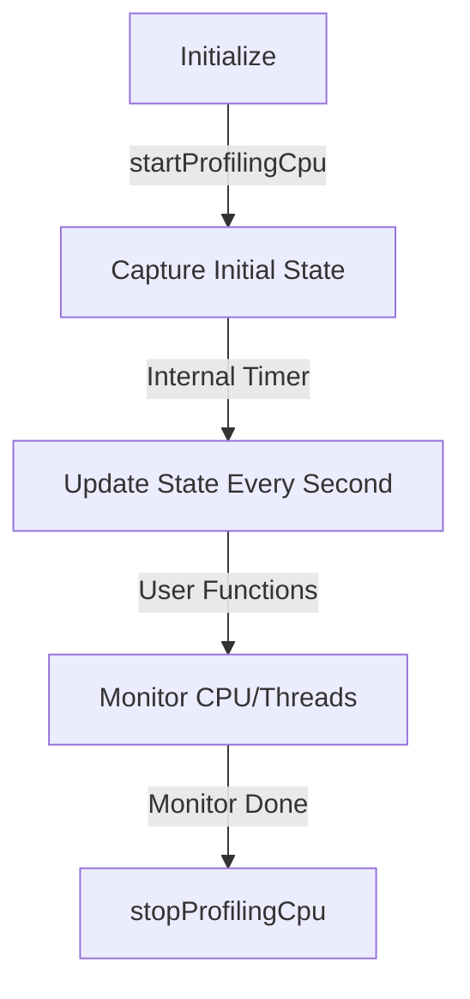
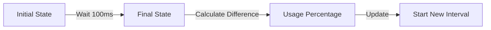
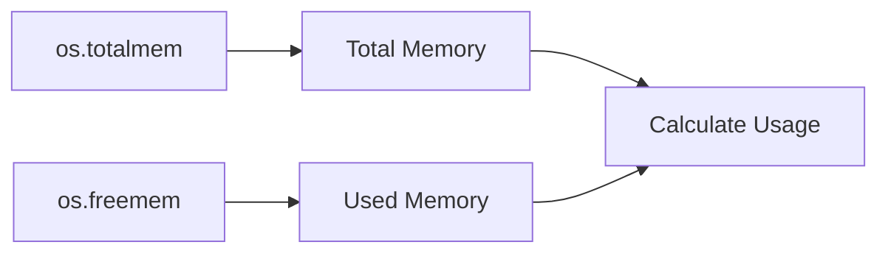

# Core Concepts

This guide explains the fundamental principles behind how System Resource Monitor works and some important considerations when using it.

## CPU Profiling Initialization

Before using any CPU or thread monitoring functions, you must initialize the profiling system:



### How to Initialize

```javascript
import { startProfilingCpu, stopProfilingCpu } from 'system-resource-monitor';

// Start monitoring
await startProfilingCpu();

// ... use CPU and thread monitoring functions ...

// Clean up when done
stopProfilingCpu();
```

:::note
Only CPU and thread monitoring functions require initialization. Memory, core information, and utility functions can be used without calling `startProfilingCpu()`.
:::

## CPU Usage Calculation

The library calculates CPU usage by measuring the difference in CPU states over time:



### How It Works

1. First, call `startProfilingCpu()` to initialize the monitoring system
2. The library captures a snapshot of each CPU thread's state, including:
  - Total time (user + system + nice + idle + irq)
  - Idle time
3. After a short interval (100ms), it captures another snapshot
4. Usage is calculated using this formula:
   ```
   usage = (totalDiff - idleDiff) / totalDiff
   ```
   where:
  - `totalDiff` = end.total - start.total
  - `idleDiff` = end.idle - start.idle

:::note Sampling Intervals
After calling `startProfilingCpu()`, the library maintains an internal state that updates every second to ensure accurate measurements. There will be a small delay (about 100ms) for the first reading while the initial state is established.
:::

## Thread States

Each CPU thread is represented by a `ThreadState` interface:

```typescript
interface ThreadState {
  index: number;  // Thread identifier
  total: number;  // Total CPU time
  idle: number;   // Idle CPU time
}
```

The library tracks these states to provide:

- Individual thread usage metrics
- Overall CPU utilization
- Statistical functions (min, max, average, median)

All thread monitoring functions require calling `startProfilingCpu()` first.

## Memory Monitoring

Memory monitoring is more straightforward as it uses direct system calls:



Memory calculations are instantaneous and don't require initialization or sampling intervals like CPU monitoring.

## Cross-Platform Support

The library handles platform-specific differences:

import Tabs from '@theme/Tabs';
import TabItem from '@theme/TabItem';

<Tabs groupId="operating-systems">
  <TabItem value="linux" label="Linux" default>
  ```bash
  # Physical core detection
  lscpu -p | egrep -v "^#" | sort -u -t, -k 2,4 | wc -l
  ```
  </TabItem>
  <TabItem value="macos" label="macOS">
  ```bash
  # Physical core detection
  sysctl -n hw.physicalcpu
  ```
  </TabItem>
  <TabItem value="windows" label="Windows">
  ```powershell
  # Physical core detection (fallback method)
  Get-CimInstance -ClassName Win32_Processor | Select-Object -ExpandProperty NumberOfCores
  ```
  </TabItem>
</Tabs>

## Important Considerations

:::caution Accuracy
The CPU usage calculations have some inherent limitations:

- Results are estimates based on sampling intervals
- Heavy system load can affect accuracy
- Virtualized environments may provide less reliable data
  :::

:::tip Best Practices

- Initialize CPU profiling with `await startProfilingCpu()` before using CPU/thread functions
- Use percentage thresholds (0-100) for readability
- Remember there's a small delay when starting monitoring
- Clean up resources with `stopProfilingCpu()` when done
- Consider the sampling interval when measuring rapid changes
  :::

## Automatic Cleanup

The library automatically registers cleanup handlers for:

- Normal process exit
- SIGINT (Ctrl+C)
- SIGTERM (termination signal)

This ensures that monitoring resources are properly released when your application exits. However, you can manually clean up by calling `stopProfilingCpu()` or its alias `cleanup()`.
